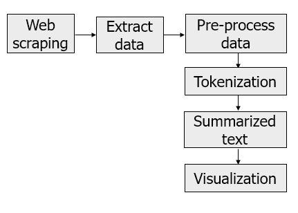
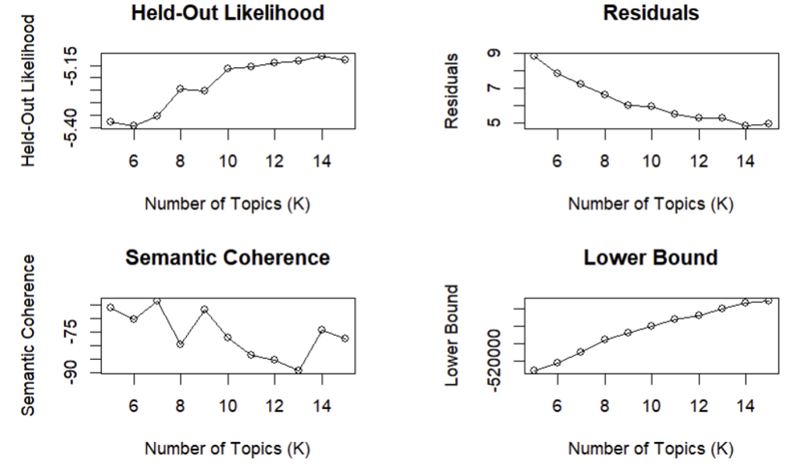
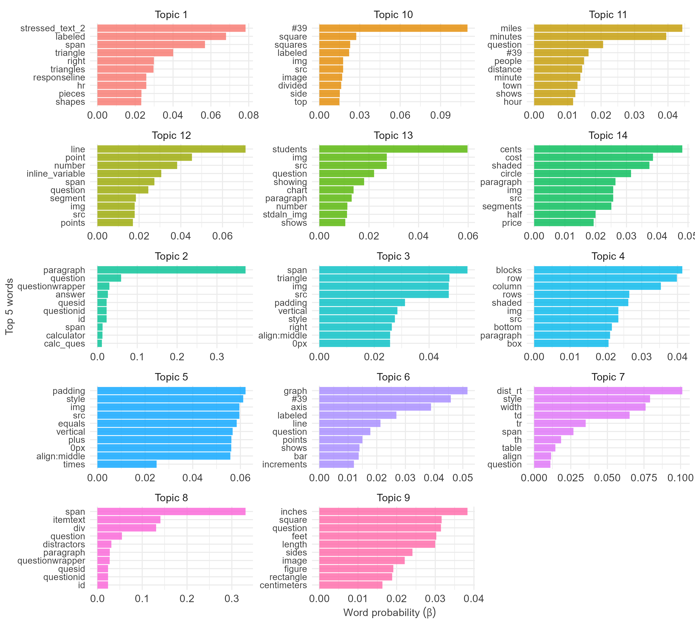
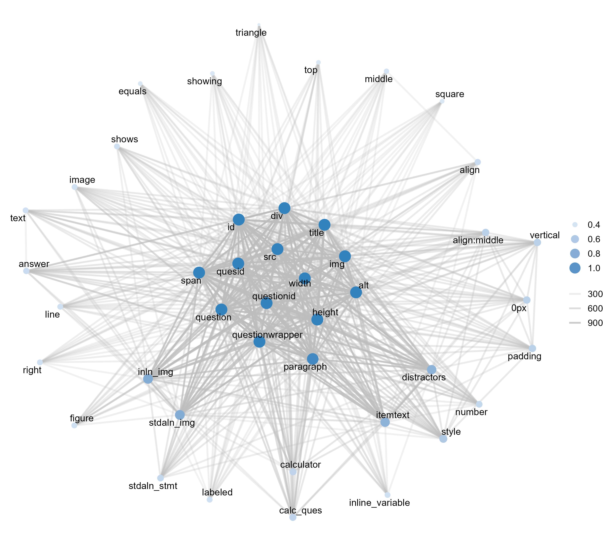

```{r, include=FALSE}
knitr::opts_chunk$set(echo = FALSE,
                      warning = FALSE,
                      tidy = FALSE,
                      message = FALSE,
                      fig.align = 'center',
                      out.width = "100%")
options(knitr.table.format = "html") 
```

# Introduction

- `Mathematics vocabulary` is a critical indicator of success in verbal and written mathematical performance (Adams, 2003).Despite the significant role of mathematics vocabulary in school, it is becoming decontextualized and is rarely used in daily conversation (Dunston & Tyminski, 2013). As the Common Core State Standards for Mathematics (National Governors Association Center for Best Practices & Council of Chief State School Officers, 2010) emphasizes in the Standards for Mathematical Practice, students are expected to use a clear mathematical definition in their discourse and reasoning. 
- Although researchers have examined the relationships between students’ mathematics achievement and related factors such as mathematics curriculum (Nargi, 2018), school sector (Lubienski & Lubienski, 2006), and trends (Kaplan & Huang, 2021), these previous studies are based on student data that do not consider text (mathematics questions) as data. With the implementation of the `text mining` technique, `unstructured text data` can be transformed into a meaningful unit of a structured format.

**Purpose.** Considering that `Text-to-Speech` (TTS) functionality is one of commonly used accommodation and essential feature of accessibility on the digital assessment, the researcher targeted on the extracted scripts (text data) from this TTS items. Using the text mining technique, the researcher aimed to identify clustered groupings and co-occurring mathematics terms on the `National Assessment of Educational Progress` (NAEP) mathematics assessment from 1990 and 2022. 

# Method

**Extraction of Data.** 
Before extracting text data from a large dataset on websites, the web scraping method enables individuals to efficiently identify targeted text information. Recently, Anglin (2019) showed the potential of implementing `web scraping` and `natural language processing` for educational data for the districts’ policy decisions. By observing the _HyperText Markup Language_ (HTML) structure of a webpage, the researcher automated the extraction of text information in a structured way through R libraries. Using Google developer tools, the researcher inspected the NAEP Questions Tool (NCES, 2021), an online database, and extract information, including text data (a total of 1,171 mathematics questions) from 1990 to 2022. Figure \@ref(fig:figure1) shows the procedures of data extraction and pre-processing.  

```{r figure1, out.width='60%', fig.cap='A Flowchart of Text Analysis'}

```

**Text Pre-Processing.** To make the textual data appropriate for the algorithm, the researcher tokenized the data by splitting complex text into smaller words. The data were normalized by transforming words into their base or root forms, changing texts to lowercase, converting accented characters to the American Standard Code for Information Interchange, and removing stop words (e.g., “a”, “an”, and “the”), numbers, HTML tags, punctuation marks, and extra white spaces. For this pre-processing, R packages, such as *textminingR* (Shin, 2022) and *tidytext* (Silge & Robinson, 2016), were used. 
 
 **Creating Customized Dictionary and Stop word lists.** The researcher processed two customized dictionary objects with matching patterns of wildcard expressions and calculated inverse document frequency (idf) of each word to create the customized stop words list. This process was completed through `quanteda` R package (Benoit et al., 2018). 
 
**Data Analysis.** 
In providing weight for commonly used words that hinder the distinction across documents, we will calculate the *term frequency−inverse document frequency* (*tf−idf*). The *tf−idf* statistics measure can examine the frequency of a word adjusted for how rarely it is included within the document (Hvitfeldt & Silge, 2021). The *tidytext* R package (Silge & Robinson, 2016) was used to calculate *tf−idf*. To visualize the semantic relations between mathematics vocabulary words, the researcher counted the co-occurrence and correlation between each word pair, then visualize the word network.

$$
t f-i d f_{i j}=t f_{i j} \times \log \left(\frac{N}{d f}\right)
$$

Note. $d f_i=$ number of documents in the corpus containing term $i, N=$ total number of documents in the corpus, $t f_{i j}=$ frequency of term $i$ in document $j$ divided by total words in document $j$. The researcher examined the importance of each individual word through a measure of degree centrality, assuming that influential and important nodes have higher neighbors (degrees) compared to other nodes with fewer degrees (Newman, 2018). 

# Results

As shown in (Figure \@ref(fig:figure2)), the diagnostic testing depicts the goodness of fit for each number of topics between 5 and 15. A topic number of 14 showed relatively low residuals, high semantic coherence, a maximized lower bound, and a high held-out likelihood. 

```{r figure2, out.width='95%', fig.cap='Diagnostic Values by Number of Topics'}

```

As shown in (Figure \@ref(fig:figure3)), the topic model results of 14 different topics across grade levels show different word probabilities for each topic. The highest probability represents the related unlabeled topic, respectively.

```{r figure3, out.width='95%', fig.cap='Highest (Top 10) Word Probabilities for Each Topic', fig.width=8, fig.height=10}

```

Figure \@ref(fig:figure4) demonstrates the semantic mapping of co-occurring words with greater than or equal to 100 co-occurrence frequency (38 nodes and 686 edges). The commonly co-occurring words show that TTS-related technical terms were central to the networks. 

```{r figure4, out.width='80%', fig.cap='Semantic Mapping of Co-Occurring Words', fig.width=7, fig.height=6}

```

# Conclusion
Observing the discussed research topics and word probabilities can provide educators with a comprehensive understanding of the distinctive features within the text. Further text pre-process procedures are required better to understand the textual structures of the NAEP math problems. Some related words demonstrated different features by grade-level problems. A follow-up study of multilevel modeling or regression-based analysis is recommended to examine the moderation effect of grade level for each text math problem question. 

# Acknowledgment

SOURCE: U.S. Department of Education, Institute of Education Sciences, National Center for Education Statistics, National Assessment of Educational Progress (NAEP), Mathematics Assessment.

**Contact.** Mikyung Shin, West Texas A&M University, mikyung.shin@wtamu.edu 

```{r, out.width='25%'}
library(cowplot)
library(ggplot2)
ggdraw() + draw_image('../figures/QR.png', scale = 1.2)
```

https://github.com/mshin77/PCRC-2023-open